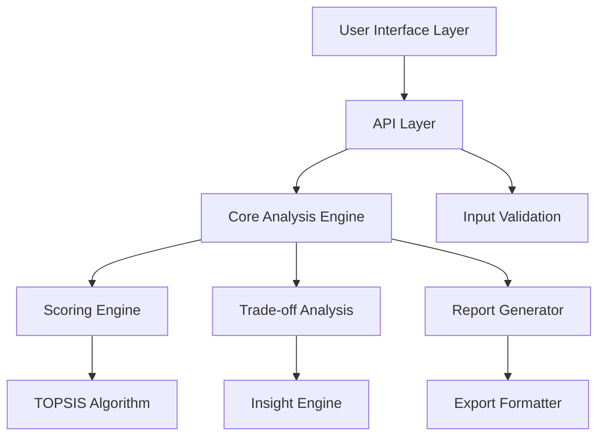

# Design Document: Option Referee

## Overview

The Option Referee is a multi-criteria decision analysis (MCDA) tool that implements a modified TOPSIS (Technique for Order of Preference by Similarity to Ideal Solution) algorithm to evaluate and rank 2-5 options against user-defined constraints. The system provides comprehensive trade-off analysis and generates actionable comparison reports to support informed decision-making.

The core approach involves normalizing option scores across constraints, applying user-defined weights, and calculating distances from ideal and negative-ideal solutions to produce rankings and insights.

## Architecture

The system follows a layered architecture with clear separation of concerns:



**Key Components:**
- **Input Layer**: Handles option and constraint data with validation
- **Core Engine**: Implements TOPSIS-based scoring and ranking
- **Analysis Layer**: Generates trade-off insights and recommendations
- **Output Layer**: Produces formatted comparison reports

## Weighted Scoring Methodology

The Option Referee implements a sophisticated weighted scoring model based on the TOPSIS algorithm, enhanced with multiple scoring approaches to handle different types of criteria and user preferences.

### Core Weighted Scoring Process

1. **Raw Score Collection**: Gather scores for each option against each constraint
2. **Normalization**: Convert scores to a common scale using vector normalization
3. **Weight Application**: Apply user-defined constraint weights to normalized scores
4. **Ideal Solution Calculation**: Determine ideal and negative-ideal solutions
5. **Distance Calculation**: Compute distances from each option to ideal solutions
6. **Final Ranking**: Calculate closeness scores and rank options

### Mathematical Foundation

**Vector Normalization Formula:**
```
normalized_score[i][j] = raw_score[i][j] / sqrt(sum(raw_score[k][j]^2 for k in options))
```

**Weight Application:**
```
weighted_score[i][j] = normalized_score[i][j] * constraint_weight[j]
```

**Ideal Solutions:**
- **Positive Ideal**: `A+ = {max(weighted_score[i][j]) for j in constraints}` (for benefit criteria)
- **Negative Ideal**: `A- = {min(weighted_score[i][j]) for j in constraints}` (for benefit criteria)

**Distance Calculations:**
```
distance_positive[i] = sqrt(sum((weighted_score[i][j] - ideal[j])^2 for j in constraints))
distance_negative[i] = sqrt(sum((weighted_score[i][j] - negative_ideal[j])^2 for j in constraints))
```

**Closeness Score:**
```
closeness[i] = distance_negative[i] / (distance_positive[i] + distance_negative[i])
```

### Alternative Scoring Methods

**Linear Scoring:**
- Direct proportional scaling between min and max values
- Best for quantitative criteria with clear linear relationships
- Formula: `(score - min) / (max - min)`

**Logarithmic Scoring:**
- Emphasizes differences at lower values more than higher values
- Useful for criteria where improvements have diminishing returns
- Formula: `log(score + 1) / log(max + 1)`

**Categorical Scoring:**
- Handles qualitative criteria with predefined categories
- Maps categories to numerical scores based on user-defined weights
- Example: "Excellent" = 1.0, "Good" = 0.8, "Fair" = 0.6, "Poor" = 0.2

### Constraint Direction Handling

**Benefit Criteria** (higher is better):
- Cost efficiency, performance, user satisfaction
- Ideal solution uses maximum values

**Cost Criteria** (lower is better):
- Price, implementation time, complexity
- Scores are inverted: `inverted_score = max_score - score + min_score`

### Weight Normalization

User-provided weights are automatically normalized to sum to 100%:
```
normalized_weight[j] = user_weight[j] / sum(user_weight[k] for k in constraints) * 100
```

This ensures mathematical consistency regardless of the scale users choose for their weights.

## Components and Interfaces

### Option Manager
Handles the collection and validation of comparison options.

```typescript
interface Option {
  id: string;
  name: string;
  description?: string;
  scores: Map<string, number>; // constraint_id -> score
  metadata?: Record<string, any>;
}

interface OptionManager {
  addOption(option: Option): Result<void, ValidationError>;
  removeOption(optionId: string): boolean;
  updateOption(optionId: string, updates: Partial<Option>): Result<void, ValidationError>;
  getOptions(): Option[];
  validateOptionCount(): Result<void, ValidationError>;
}
```

### Constraint Manager
Manages evaluation criteria and their importance weights.

```typescript
interface Constraint {
  id: string;
  name: string;
  weight: number; // 0-100, normalized to sum to 100%
  type: 'cost' | 'performance' | 'efficiency' | 'custom';
  direction: 'maximize' | 'minimize'; // higher is better vs lower is better
  scale: ScaleDefinition;
}

interface ConstraintManager {
  addConstraint(constraint: Constraint): Result<void, ValidationError>;
  updateWeight(constraintId: string, weight: number): Result<void, ValidationError>;
  normalizeWeights(): void;
  getConstraints(): Constraint[];
  getWeightedConstraints(): Map<string, number>;
}
```

### TOPSIS Scoring Engine
Implements the core TOPSIS algorithm for multi-criteria evaluation with comprehensive weighted scoring.

```typescript
interface TOPSISEngine {
  calculateScores(options: Option[], constraints: Constraint[]): ScoringResult;
  normalizeMatrix(rawScores: number[][]): number[][];
  applyWeights(normalizedMatrix: number[][], weights: number[]): number[][];
  calculateIdealSolutions(weightedMatrix: number[][], constraints: Constraint[]): {
    ideal: number[];
    negativeIdeal: number[];
  };
  calculateDistances(weightedMatrix: number[][], ideal: number[], negativeIdeal: number[]): {
    positiveDistances: number[];
    negativeDistances: number[];
  };
  calculateClosenessScores(positiveDistances: number[], negativeDistances: number[]): number[];
}

interface WeightedScoringModel {
  // Core weighted scoring implementation
  calculateWeightedScore(optionScores: Map<string, number>, constraintWeights: Map<string, number>): number;
  
  // Alternative scoring methods
  calculateLinearScore(score: number, min: number, max: number): number;
  calculateLogarithmicScore(score: number, base: number): number;
  calculateCategoricalScore(category: string, categoryWeights: Map<string, number>): number;
  
  // Normalization methods
  vectorNormalization(scores: number[]): number[];
  minMaxNormalization(scores: number[]): number[];
  zScoreNormalization(scores: number[]): number[];
}

interface ScoringResult {
  rankings: OptionRanking[];
  normalizedScores: Map<string, Map<string, number>>; // option_id -> constraint_id -> normalized_score
  weightedScores: Map<string, Map<string, number>>; // option_id -> constraint_id -> weighted_score
  closenessScores: Map<string, number>; // option_id -> closeness_score
  idealSolution: number[];
  negativeIdealSolution: number[];
  scoringMethodology: ScoringMethodology;
}

interface ScoringMethodology {
  normalizationMethod: 'vector' | 'minmax' | 'zscore';
  weightingApproach: 'linear' | 'logarithmic' | 'categorical';
  distanceMetric: 'euclidean' | 'manhattan' | 'chebyshev';
  idealSolutionMethod: 'max_min' | 'user_defined';
}
```
```

### Trade-off Analysis Engine
Analyzes performance differences and generates insights.

```typescript
interface TradeOffAnalyzer {
  analyzeTradeOffs(scoringResult: ScoringResult, options: Option[], constraints: Constraint[]): TradeOffAnalysis;
  identifyStrengths(option: Option, constraints: Constraint[]): ConstraintPerformance[];
  identifyWeaknesses(option: Option, constraints: Constraint[]): ConstraintPerformance[];
  findDominantOptions(options: Option[], constraints: Constraint[]): DominanceAnalysis;
  generateRecommendations(analysis: TradeOffAnalysis): Recommendation[];
}

interface TradeOffAnalysis {
  optionAnalyses: Map<string, OptionAnalysis>;
  pairwiseComparisons: PairwiseComparison[];
  dominanceRelations: DominanceAnalysis;
  recommendations: Recommendation[];
}
```

### Report Generator
Creates comprehensive comparison reports with visualizations.

```typescript
interface ReportGenerator {
  generateReport(analysis: TradeOffAnalysis, options: Option[], constraints: Constraint[]): ComparisonReport;
  createExecutiveSummary(analysis: TradeOffAnalysis): ExecutiveSummary;
  generateVisualizations(scoringResult: ScoringResult): Visualization[];
  formatForExport(report: ComparisonReport, format: 'json' | 'markdown' | 'html'): string;
}

interface ComparisonReport {
  executiveSummary: ExecutiveSummary;
  rankings: OptionRanking[];
  tradeOffAnalysis: TradeOffAnalysis;
  visualizations: Visualization[];
  methodology: MethodologyDescription;
  timestamp: Date;
}
```

## Data Models

### Core Data Structures

```typescript
interface OptionRanking {
  option: Option;
  rank: number;
  closenessScore: number;
  strengthAreas: string[];
  weaknessAreas: string[];
}

interface ConstraintPerformance {
  constraintId: string;
  constraintName: string;
  score: number;
  normalizedScore: number;
  percentileRank: number;
}

interface PairwiseComparison {
  optionA: string;
  optionB: string;
  winner: string;
  significantDifferences: ConstraintDifference[];
  overallScoreDifference: number;
}

interface ConstraintDifference {
  constraintId: string;
  constraintName: string;
  scoreDifference: number;
  percentageDifference: number;
  significance: 'low' | 'medium' | 'high';
}

interface Recommendation {
  type: 'best_overall' | 'best_for_constraint' | 'compromise' | 'avoid';
  optionId: string;
  reasoning: string;
  confidence: number;
  conditions?: string[];
}
```

### Validation Models

```typescript
interface ValidationError {
  field: string;
  message: string;
  code: string;
}

interface ValidationResult {
  isValid: boolean;
  errors: ValidationError[];
  warnings: string[];
}
```

## Correctness Properties

*A property is a characteristic or behavior that should hold true across all valid executions of a system-essentially, a formal statement about what the system should do. Properties serve as the bridge between human-readable specifications and machine-verifiable correctness guarantees.*

Before defining the correctness properties, I need to analyze the acceptance criteria to determine which ones are testable as properties, examples, or edge cases.

### Converting EARS to Properties

Based on the prework analysis, I'll convert the testable acceptance criteria into universally quantified properties, eliminating redundancy where identified.

**Property 1: Option Management Completeness**
*For any* valid option with unique identifier, the system should successfully store the option with all descriptive information intact and allow subsequent editing or removal operations.
**Validates: Requirements 1.1, 1.4, 1.5**

**Property 2: Option Count Validation**
*For any* option set, the system should prevent comparison when fewer than 2 options exist and prevent addition when more than 5 options exist, maintaining the current valid option set.
**Validates: Requirements 1.2, 1.3**

**Property 3: Constraint Weight Normalization**
*For any* set of constraint weights, the system should normalize them to sum to exactly 100% and automatically recalculate all scores when weights change.
**Validates: Requirements 2.2, 2.4, 3.4**

**Property 4: Constraint Management Flexibility**
*For any* constraint definition (predefined or custom), the system should accept and process the constraint with its importance weight correctly.
**Validates: Requirements 2.1, 2.5**

**Property 5: Scoring Consistency**
*For any* set of options and constraints, the system should score each option against each constraint on a consistent scale and calculate mathematically correct weighted total scores.
**Validates: Requirements 3.1, 3.2**

**Property 6: Data Validation and Error Handling**
*For any* input data (valid or invalid), the system should validate data types and ranges, provide descriptive error messages for invalid inputs, handle missing data gracefully, and maintain system stability.
**Validates: Requirements 6.1, 6.2, 6.4**

**Property 7: Data Normalization**
*For any* input data format, the system should sanitize and normalize the data to ensure consistent processing regardless of input format.
**Validates: Requirements 6.3, 6.5**

**Property 8: Trade-off Analysis Completeness**
*For any* completed scoring, the system should identify strengths and weaknesses for each option, highlight significant performance differences, detect dominance relationships, and provide clear trade-off explanations.
**Validates: Requirements 4.1, 4.2, 4.3, 4.4**

**Property 9: Recommendation Generation**
*For any* analysis with constraint priorities, the system should generate contextual recommendations that align with the weighted importance of constraints.
**Validates: Requirements 4.5**

**Property 10: Report Generation Completeness**
*For any* completed analysis, the system should generate a structured report with proper rankings based on weighted scores, visual representations, executive summary, and shareable formatting.
**Validates: Requirements 5.1, 5.2, 5.3, 5.4, 5.5**

**Property 11: Methodology Transparency**
*For any* scoring operation, the system should provide clear information about the scoring methodology and scale being used.
**Validates: Requirements 3.5**

**Property 12: Configuration Persistence**
*For any* user configuration, the system should properly save, validate compatibility, and restore configurations for future use.
**Validates: Requirements 7.3, 7.5**

## Error Handling

The system implements comprehensive error handling across all layers:

### Input Validation Errors
- **Invalid Option Count**: Clear messages when attempting comparison with <2 or >5 options
- **Duplicate Identifiers**: Descriptive errors when option IDs conflict
- **Invalid Weights**: Validation errors for negative or non-numeric constraint weights
- **Missing Required Data**: Specific identification of missing option scores or constraint definitions

### Processing Errors
- **Calculation Failures**: Graceful handling of mathematical edge cases (division by zero, invalid ranges)
- **Data Inconsistency**: Detection and reporting of mismatched option/constraint data
- **Memory Constraints**: Appropriate handling of large datasets with performance warnings

### Output Errors
- **Report Generation Failures**: Fallback to simplified reports when visualization generation fails
- **Export Format Errors**: Clear messages when requested export formats are unavailable

### Error Recovery Strategies
- **Partial Data Processing**: Continue analysis with available data when some inputs are missing
- **Default Value Substitution**: Use reasonable defaults for optional parameters
- **Graceful Degradation**: Provide basic functionality when advanced features fail

## Testing Strategy

The testing approach combines unit tests for specific functionality with property-based tests for universal correctness guarantees.

### Property-Based Testing
Property-based tests will be implemented using a suitable testing library for the chosen programming language. Each test will run a minimum of 100 iterations to ensure comprehensive input coverage.

**Test Configuration:**
- **Minimum iterations**: 100 per property test
- **Tag format**: **Feature: option-referee, Property {number}: {property_text}**
- **Generator constraints**: Smart generators that produce valid option sets, constraint definitions, and weight distributions

**Key Property Test Areas:**
- **Mathematical Correctness**: TOPSIS calculations, weight normalization, score aggregation
- **Data Integrity**: Option storage, constraint management, configuration persistence
- **Boundary Validation**: Option count limits, weight ranges, score boundaries
- **Error Handling**: Invalid input processing, system stability under stress

### Unit Testing
Unit tests focus on specific examples, edge cases, and integration points:

**Core Functionality Tests:**
- TOPSIS algorithm implementation with known input/output pairs
- Weight normalization with specific weight sets
- Report generation with sample data sets

**Edge Case Tests:**
- Empty option sets, single options
- Zero weights, extreme weight distributions
- Missing scores, incomplete constraint definitions
- Boundary values for all numeric inputs

**Integration Tests:**
- End-to-end comparison workflows
- Configuration save/load cycles
- Report export in multiple formats

### Test Data Generation
Smart generators will create realistic test scenarios:
- **Option generators**: Varied option sets with realistic score distributions
- **Constraint generators**: Balanced constraint sets with appropriate weights
- **Scenario generators**: Common decision-making scenarios (technology selection, vendor evaluation, etc.)

The dual testing approach ensures both mathematical correctness through property-based testing and practical functionality through targeted unit tests.